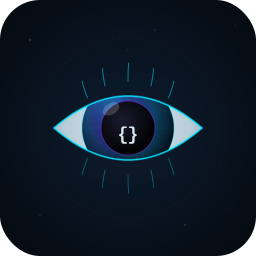
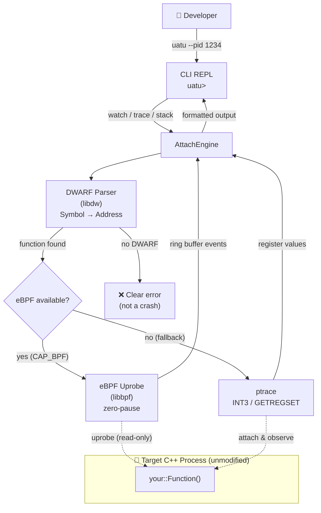

# uatu

<p align="center">
  
</p>

```
 _   _    _   _____ _   _
| | | |  / \ |_   _| | | |
| | | | / _ \  | | | | | |
| |_| |/ ___ \ | | | |_| |
 \___//_/   \_\|_|  \___/
```

**Attach. Observe. Never interfere.**

Attach to any running C++ process. Observe functions, trace call chains, capture stack frames — without restarting, without modifying code.

[](#)
[](#license)
[](#)
[](#)

---

## Features

- **`watch <func>`** — Observe function return values and latency via eBPF uprobes (zero overhead; auto-falls back to ptrace when eBPF is unavailable)
- **`trace <func>`** — Trace the full call chain under a function with per-frame timing (ptrace + INT3 breakpoints)
- **`stack <func>`** — Capture the complete call stack at the moment a function is entered (ptrace frame-pointer walk)
- **Non-intrusive** — No code changes, no recompilation, no process restart
- **Graceful degradation** — eBPF → ptrace fallback is transparent to the user
- **Clear error messages** — Stripped binaries, inlined functions, and missing capabilities are reported with actionable hints

---

## How It Works



---

## Quick Start

### Prerequisites (Ubuntu 22.04+)

```bash
sudo apt install \
  libdw-dev libelf-dev libbpf-dev \
  clang bpftool cmake build-essential
```

### Build

> **Ubuntu 22.04 + kernel ≥ 6.x 用户：** 系统 libbpf (0.5.0) 与新内核 BTF 不兼容，需先编译 vendored libbpf v1.4.3：
> ```bash
> cd third_party/libbpf/src
> make BUILD_STATIC_ONLY=1 OBJDIR=$(pwd)/../../../build/libbpf
> make BUILD_STATIC_ONLY=1 OBJDIR=$(pwd)/../../../build/libbpf \
>      DESTDIR=$(pwd)/../../../build/libbpf PREFIX="" install
> cd ../../..
> ```
> CMake 会自动检测并优先使用它，系统 libbpf 作为 fallback。

```bash
git clone https://github.com/YOUR_ORG/uatu
cd uatu
cmake -B build -S . -DCMAKE_BUILD_TYPE=Release
cmake --build build -j$(nproc)
```

### Run

```bash
# Attach to a running process by PID
sudo ./build/src/cli/uatu --pid <TARGET_PID>
```

> **Permissions:** eBPF mode requires `root` or `CAP_BPF + CAP_PERFMON`. ptrace mode requires `root` or `ptrace_scope=0` (`echo 0 | sudo tee /proc/sys/kernel/yama/ptrace_scope`).

---

## Usage

```
$ uatu --pid 1234
uatu 1234 attached
Commands: watch <func>  trace <func>  stack <func>  help  quit
```

### watch — Observe return value and latency

```
uatu> watch fixtures::Calculator::add
ts=1750000000123  func=fixtures::Calculator::add  cost=0.042ms  ret=3
```

Fires on every invocation. Press `Ctrl-C` to stop watching.

> **Note:** The target binary must be compiled with `-g` (DWARF debug info). Functions inlined by `-O2` are not observable — uatu will tell you if this is the case.

### trace — Trace the call subtree with timing

```
uatu> trace fixtures::Foo::slow
+-fixtures::Foo::slow [2.341ms]
  +-fixtures::Foo::add_internal [0.001ms]
```

### stack — Capture call stack at function entry

```
uatu> stack fixtures::Calculator::add
func=fixtures::Calculator::add
  [0] fixtures::Calculator::add(int, int)
  [1] main
```

---

## Architecture

```
┌─────────────────────────────────────────────┐
│                uatu CLI                     │
│          (attach, REPL, formatter)          │
└──────────────────┬──────────────────────────┘
                   │
         ┌─────────▼─────────┐
         │   AttachEngine    │
         │  (watch/trace/    │
         │       stack)      │
         └──┬────────────┬───┘
            │            │
   ┌────────▼───┐  ┌─────▼──────┐
   │ eBPF Layer │  │ptrace Layer│
   │  (uprobe)  │  │ (INT3/FP)  │
   └────────────┘  └────────────┘
            │            │
   ┌────────▼────────────▼───────┐
   │     DWARF Symbol Resolver   │
   │    (libdw / elfutils)       │
   └─────────────────────────────┘
```

### Repository Layout

```
uatu/
├── include/uatu/
│   ├── types.h              # Core data types
│   ├── dwarf/               # DWARF symbol resolution
│   ├── ebpf/                # eBPF uprobe loader
│   ├── engine/              # AttachEngine (watch/trace/stack)
│   └── cli/                 # Output formatting
├── src/                     # Implementation
├── ebpf/                    # BPF programs (.bpf.c)
└── tests/                   # Unit tests + integration tests
```

---

## Limitations

| Constraint | Detail |
|---|---|
| Platform | Linux x86_64 only |
| DWARF required | `watch` needs `-g` debug info; stripped binaries return a clear error |
| Inlined functions | `-O2` inlined functions are not observable (hint is printed) |
| eBPF privileges | `root` or `CAP_BPF + CAP_PERFMON` (kernel >= 4.18) |
| ptrace privileges | `root` or `ptrace_scope=0` |

---

## Roadmap

### Phase 1 — MVP (current)
- [x] `watch` via eBPF uprobes with ptrace fallback
- [x] `trace` call chain with per-frame timing
- [x] `stack` frame-pointer walk

### Phase 2 — Agent Library & Advanced Commands
- [ ] Embeddable agent library (`#include <uatu.h>`)
- [ ] Time-tunnel `tt` — record and replay function invocations
- [ ] Hot-patch `retransform` — replace function body at runtime

### Phase 3 — Observability Platform
- [ ] Web Console with live function metrics
- [ ] Flame graph generation
- [ ] vcpkg package publication

---

## Contributing

Contributions are welcome. Please open an issue first to discuss what you'd like to change.

1. Fork the repository
2. Create your feature branch (`git checkout -b feature/amazing-feature`)
3. Commit your changes (`git commit -m 'feat: add amazing feature'`)
4. Push to the branch (`git push origin feature/amazing-feature`)
5. Open a Pull Request

All contributions must pass CI and include tests for new functionality.

---

## License

Apache License 2.0 — see [LICENSE](LICENSE) for details.
