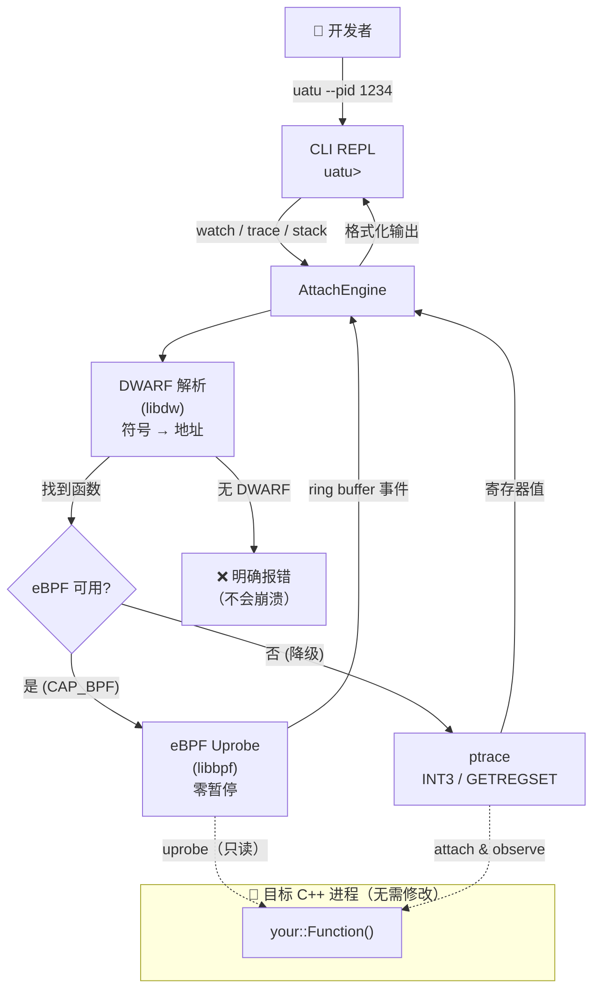

# uatu

<p align="center">
  
</p>

```
 _   _    _   _____ _   _
| | | |  / \ |_   _| | | |
| | | | / _ \  | | | | | |
| |_| |/ ___ \ | | | |_| |
 \___//_/   \_\|_|  \___/
```

**Attach 即用，只观察，永不干涉。**

Attach 到任意运行中的 C++ 进程，观测函数、追踪调用链、采集调用栈——无需重启，无需修改代码。

[](#)
[](#许可证)
[](#)
[](#)

---

## 背景

做过 Java 线上排查的同学都知道 Arthas：进程跑着，问题突然出现，你不需要重启，不需要加日志，`watch` 一下就能看到函数入参和返回值，`trace` 一下就知道哪一层调用在拖慢整条链路。

C++ 生态一直缺这样的工具。

遇到线上问题，通常的选项是：加日志重新编译、用 gdb attach（影响进程响应）、凭经验猜。这三条路要么代价高，要么风险大，要么靠运气。

uatu 就是为了填这个空白而生。它利用 Linux 内核的 eBPF uprobes 机制，以几乎零开销的方式挂载到目标函数；在 eBPF 不可用的环境下，自动降级为 ptrace，保证可用性。整个过程对目标进程透明，不需要重新编译，不需要停服。

---

## 核心能力

- **`watch <func>`** — 观测函数每次调用的返回值和耗时（eBPF uprobe，接近零开销；无 eBPF 时自动降级为 ptrace）
- **`trace <func>`** — 追踪函数完整调用子树，显示每层耗时（ptrace + INT3 断点）
- **`stack <func>`** — 采集函数被调用时的完整调用栈（ptrace frame-pointer 遍历）
- **非侵入式** — 不修改代码，不重新编译，不重启进程
- **透明降级** — eBPF → ptrace 自动切换，对用户无感
- **明确的错误提示** — strip 二进制、内联函数、权限不足等情况，均给出可操作的提示

---

## 工作原理



---

## 快速开始

### 安装依赖（Ubuntu 22.04+）

```bash
sudo apt install \
  libdw-dev libelf-dev libbpf-dev \
  clang bpftool cmake build-essential
```

### 编译

```bash
git clone https://github.com/YOUR_ORG/uatu
cd uatu
cmake -B build -S . -DCMAKE_BUILD_TYPE=Release
cmake --build build -j$(nproc)
```

### 运行

```bash
# 通过 PID attach 到目标进程
sudo ./build/src/cli/uatu --pid <TARGET_PID>
```

> **权限说明：** eBPF 模式需要 `root` 或 `CAP_BPF + CAP_PERFMON`。ptrace 模式需要 `root` 或将 `ptrace_scope` 设为 0（`echo 0 | sudo tee /proc/sys/kernel/yama/ptrace_scope`）。

---

## 使用示例

```
$ uatu --pid 1234
uatu 1234 attached
Commands: watch <func>  trace <func>  stack <func>  help  quit
```

### watch — 观测返回值和耗时

```
uatu> watch fixtures::Calculator::add
ts=1750000000123  func=fixtures::Calculator::add  cost=0.042ms  ret=3
  params=[1, 2]
```

每次调用触发一次输出。按 `Ctrl-C` 停止观测。

> **注意：** 目标二进制需要包含 DWARF 调试信息（编译时加 `-g`）。被 `-O2` 内联的函数无法观测，uatu 会明确告知。

### trace — 追踪调用链及各层耗时

```
uatu> trace fixtures::Foo::slow
+-fixtures::Foo::slow [2.341ms]
  +-fixtures::Foo::add_internal [0.001ms]
```

可以直观地看出哪一层函数是瓶颈。

### stack — 采集调用栈

```
uatu> stack fixtures::Calculator::add
func=fixtures::Calculator::add
  [0] fixtures::Calculator::add(int, int)
  [1] main
```

---

## 架构概览

```
┌─────────────────────────────────────────────┐
│             uatu CLI 层                 │
│        （attach、交互式 REPL、格式化输出）     │
└──────────────────┬──────────────────────────┘
                   │
         ┌─────────▼─────────┐
         │   AttachEngine    │
         │ （watch/trace/     │
         │       stack）      │
         └──┬────────────┬───┘
            │            │
   ┌────────▼───┐  ┌─────▼──────┐
   │  eBPF 层   │  │ ptrace 层  │
   │  (uprobe)  │  │ (INT3/FP)  │
   └────────────┘  └────────────┘
            │            │
   ┌────────▼────────────▼───────┐
   │     DWARF 符号解析层         │
   │    (libdw / elfutils)       │
   └─────────────────────────────┘
```

### 目录结构

```
uatu/
├── include/uatu/
│   ├── types.h              # 核心数据类型
│   ├── dwarf/               # DWARF 符号解析
│   ├── ebpf/                # eBPF uprobe loader
│   ├── engine/              # AttachEngine（watch/trace/stack）
│   └── cli/                 # 输出格式化
├── src/                     # 各模块实现
├── ebpf/                    # BPF 内核程序（.bpf.c）
└── tests/                   # 单元测试 + 集成测试
```

---

## 已知限制

| 限制 | 说明 |
|---|---|
| 平台 | 仅支持 Linux x86_64 |
| 需要 DWARF | `watch` 命令需要目标二进制含 `-g` 调试信息；strip 后的二进制会给出明确错误 |
| 内联函数 | `-O2` 内联的函数不可观测，工具会给出提示 |
| eBPF 权限 | 需要 `root` 或 `CAP_BPF + CAP_PERFMON`（内核 >= 4.18） |
| ptrace 权限 | 需要 `root` 或 `ptrace_scope=0` |

---

## 路线图

### Phase 1 — MVP（当前）
- [x] `watch`：eBPF uprobe + ptrace 自动降级
- [x] `trace`：调用链追踪，各层计时
- [x] `stack`：frame-pointer 调用栈采集

### Phase 2 — Agent 库 & 高级命令
- [ ] 可嵌入的 agent 库（`#include <uatu.h>`）
- [ ] 时间隧道 `tt` — 录制并回放函数调用
- [ ] 热修复 `retransform` — 运行时替换函数体

### Phase 3 — 可观测平台
- [ ] Web 控制台，实时函数指标
- [ ] 火焰图生成
- [ ] vcpkg 包发布

---

## 参与贡献

欢迎提交 Issue 和 PR。

1. Fork 本仓库
2. 创建你的特性分支（`git checkout -b feature/your-feature`）
3. 提交你的改动（`git commit -m 'feat: 添加某功能'`）
4. 推送到你的分支（`git push origin feature/your-feature`）
5. 发起 Pull Request

所有 PR 需通过 CI，并为新功能附带测试。

---

## 许可证

Apache License 2.0 — 详见 [LICENSE](LICENSE)。
