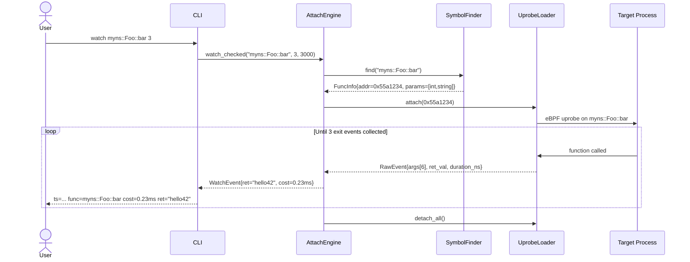
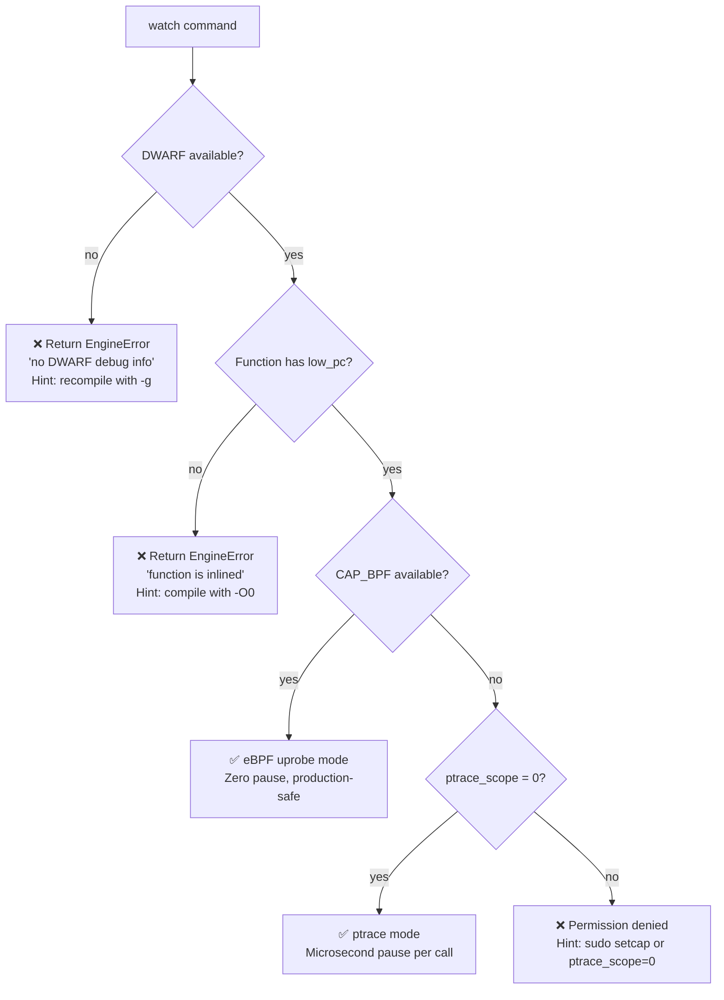

# 架构文档

## 整体架构

```
┌─────────────────────────────────────────────────────────┐
│                        uatu CLI                         │
│   --pid <PID>  →  REPL  →  格式化输出 (Formatter)       │
└───────────────────────────┬─────────────────────────────┘
                            │  watch / trace / stack
                 ┌──────────▼──────────┐
                 │    AttachEngine     │
                 │  (高层命令调度中心)  │
                 └──────┬──────────┬──┘
                        │          │
           ┌────────────▼──┐  ┌────▼────────────┐
           │  eBPF Layer   │  │  ptrace Layer   │
           │  UprobeLoader │  │  INT3 + FP walk │
           └────────────┬──┘  └────┬────────────┘
                        │          │
           ┌────────────▼──────────▼────────────┐
           │       DWARF Symbol Resolver        │
           │   SymbolFinder (libdw / elfutils)  │
           └────────────────────────────────────┘
                            │
                 ┌──────────▼──────────┐
                 │    目标进程 (ELF)    │
                 │  运行中，不重启      │
                 └─────────────────────┘
```

数据流向：

1. CLI 解析用户命令（`watch foo`），调用 `AttachEngine`
2. `AttachEngine` 先调用 `SymbolFinder` 解析 DWARF，获得函数虚拟地址
3. 若 eBPF 可用，`UprobeLoader` attach uprobe；否则 ptrace 设置断点
4. 事件回调触发，`AttachEngine` 收集返回值 / 调用链 / 调用栈
5. `Formatter` 将结果格式化并输出到终端

---

## 两种工作模式

### eBPF 模式（默认，推荐）

**触发条件：** 系统有 Clang（构建时编译了 BPF skeleton），且运行时有 `CAP_BPF + CAP_PERFMON` 或 root。

**实现机制：**

- 使用 **libbpf** attach uprobe 到目标函数的入口和返回地址
- BPF 程序在内核态采集 `bpf_get_smp_processor_id()`、`bpf_ktime_get_ns()`、返回值（rax 寄存器）
- 通过 **BPF ring buffer** 将事件异步传递给用户态
- 目标线程**不会被暂停**，开销极低（纳秒级 uprobe overhead）

**适用命令：** `watch`（零侵入高性能观测）

**优点：**

- 对目标进程性能影响可忽略
- 可在高并发场景持续观测
- 内核态过滤，减少用户态处理量

---

### ptrace 模式（自动降级）

**触发条件：** eBPF 不可用（无 Clang、无 CAP_BPF、内核版本过低），或命令本身需要 ptrace（`trace`、`stack`）。

**实现机制：**

- 使用 `ptrace(PTRACE_ATTACH)` 接管目标进程
- `trace` 命令：在目标函数入口/返回处各设置一个 **INT3 软件断点**，记录单层调用耗时
- `stack` 命令：函数入口处暂停，通过 **frame pointer（rbp）链** 回溯完整调用栈
- 读取/写入 `PTRACE_PEEKDATA` / `PTRACE_POKEDATA` 以插入和还原断点指令

**适用命令：** `trace`、`stack`（也可 fallback `watch`）

**注意：** ptrace 模式每次断点触发时目标线程会短暂暂停（微秒级）。高频函数的生产环境建议优先使用 eBPF 模式。

---

## 核心模块说明

### `uatu::dwarf::SymbolFinder`

**文件：** `include/uatu/dwarf/`、`src/dwarf/`

**职责：** 解析目标 ELF 文件的 DWARF 调试信息，提供三种符号查找方式：

| 接口 | 描述 |
|---|---|
| `find(name)` | 按函数全名精确匹配（含命名空间、类名） |
| `find_regex(pattern)` | 正则表达式匹配，返回所有匹配函数 |
| `lookup_by_addr(addr)` | 按虚拟地址反查函数名（用于 stack 解析） |

**关键设计：**

- 优先使用 `.debug_info` + `.debug_aranges` 快速定位编译单元
- 检测内联函数（`DW_AT_inline`）并给出友好提示，而非静默失败
- 区分"无 DWARF"（stripped 二进制）和"有 DWARF 但函数已内联"两种错误，分别提示

**为什么 DWARF-first？** 见下方"DWARF-first 设计"章节。

---

### `uatu::ebpf::UprobeLoader`

**文件：** `include/uatu/ebpf/`、`src/ebpf/`、`ebpf/*.bpf.c`

**职责：** 封装 libbpf API，将 BPF 程序 attach 到目标函数地址。

**关键流程：**

```
1. 打开 BPF skeleton（编译时由 bpftool gen skeleton 生成）
2. 设置目标 PID 过滤（避免采集其他进程事件）
3. bpf_program__attach_uprobe(prog, false, pid, path, offset)
4. 注册 ring buffer 回调，异步接收事件
5. 用户调用 stop() 时 detach，还原目标进程状态
```

**BPF 程序逻辑（`ebpf/watch.bpf.c`）：**

- `uprobe_entry`：函数入口，记录时间戳、参数寄存器（rdi/rsi/rdx/rcx）
- `uprobe_return`：函数返回，读取 rax（返回值），计算耗时，写入 ring buffer

---

### `uatu::AttachEngine`

**文件：** `include/uatu/engine/`、`src/engine/`

**职责：** 高层命令调度中心，组合 DWARF + eBPF/ptrace，对外暴露三个命令接口。

```cpp
class AttachEngine {
public:
    // pid 通过构造函数传入，无需单独 attach()
    explicit AttachEngine(int pid);

    // watch：eBPF 优先，ptrace fallback；watch_checked 返回 tl::expected 供错误处理
    tl::expected<std::vector<WatchEvent>, EngineError>
    watch_checked(const std::string& func_name, int max_events, int timeout_ms);

    std::vector<WatchEvent>
    watch(const std::string& func_name, int max_events, int timeout_ms);

    // trace / stack：始终使用 ptrace
    std::vector<TraceNode> trace(const std::string& func_name, int count, int timeout_ms);
    std::vector<StackEvent> stack(const std::string& func_name, int count, int timeout_ms);
};
```

**模式选择逻辑：**

```
AttachEngine engine(pid);   // 构造时解析 /proc/<pid>/exe

watch_checked(func) 调用时：
  先通过 SymbolFinder 解析 DWARF 获取函数地址
  if (BPF_OBJ_PATH 可读 && bpf_object__load 成功):
      UprobeLoader.attach(func_addr)  → eBPF 模式
  else:
      调用 trace() 采集耗时和返回值   → ptrace 降级模式

trace(func) / stack(func):
      始终使用 ptrace 模式（需要精确断点控制）
```

---

### `uatu::cli`

**文件：** `include/uatu/cli/`、`src/cli/`

**职责：** 用户交互层，包含两部分：

**REPL（Read-Eval-Print Loop）：**

- 读取用户输入，解析命令（`watch`、`trace`、`stack`、`help`、`quit`）
- 调用 `AttachEngine` 对应接口
- 当前版本 `Ctrl-C` 会退出 uatu 进程（REPL 内停止单条命令而保持运行的功能规划中）

**Formatter（格式化输出）：**

- `WatchFormatter`：格式化 watch 事件为单行 `ts=... func=... cost=... ret=...`
- `TraceFormatter`：递归打印调用树，缩进 + `+-` 前缀，每帧显示耗时
- `StackFormatter`：编号行列表，`[N] function_name`

---

## DWARF-first 设计

**为什么先查 DWARF，再走 eBPF/ptrace？**

许多工具选择直接用符号表（`nm`、`/proc/<pid>/maps` + `dlsym`）定位函数地址。uatu 选择 DWARF-first，原因如下：

1. **早失败（fail fast）** — stripped 二进制（生产环境常见）缺少符号表，但通常也缺少 DWARF。提前检测并报错，比 eBPF attach 失败后报"找不到地址"更友好。

2. **内联检测** — 符号表中不存在内联函数（编译器已展开），但 DWARF 的 `DW_AT_inline` 记录了哪些函数被内联。uatu 可以给出"此函数已被内联，请用 `-O0` 重新编译"的精确提示。

3. **参数类型信息** — DWARF 包含函数签名（参数类型、大小、偏移），使 uatu 可以正确解释寄存器中的参数值。

4. **一致性** — 所有三个命令（watch/trace/stack）都通过同一个 `SymbolFinder` 获取地址，避免不同路径产生不一致结果。

---

## 数据流：watch 命令的完整生命周期

以 `watch fixtures::Calculator::add` 为例：

```
用户输入
  │
  ▼
CLI::parse("watch fixtures::Calculator::add")
  │
  ▼
AttachEngine::watch("fixtures::Calculator::add", callback)
  │
  ├─ SymbolFinder::find("fixtures::Calculator::add")
  │    ├─ 打开 /proc/<pid>/exe 读取 ELF
  │    ├─ 解析 .debug_info，遍历 DW_TAG_subprogram
  │    ├─ 匹配到函数，返回 {vaddr: 0x401234, size: 42}
  │    └─ 检查是否内联 → 否，继续
  │
  ├─ [eBPF 可用] UprobeLoader::attach(pid, "/proc/<pid>/exe", offset=0x1234)
  │    ├─ bpf_program__attach_uprobe(uprobe_entry, pid, path, offset)
  │    ├─ bpf_program__attach_uprobe(uprobe_return, pid, path, offset)  ← uretprobe
  │    └─ ring_buffer__poll() 开始监听事件
  │
  │   [eBPF 不可用] ptrace_watch(pid, vaddr=0x401234)
  │    ├─ ptrace(PTRACE_ATTACH, pid)
  │    ├─ 在 0x401234 写入 INT3（0xCC），保存原字节
  │    └─ 等待 SIGTRAP 信号
  │
  ▼
事件触发（函数被调用）
  │
  ├─ [eBPF] ring buffer 回调：{ts, cost_ns, retval, params[]}
  └─ [ptrace] SIGTRAP → 读取 rax / rdi / rsi → 恢复 INT3 → 继续执行
  │
  ▼
WatchFormatter::format(event)
  → "ts=1750000000123  func=...  cost=0.042ms  ret=3"
  │
  ▼
输出到终端
```

---

## 仓库结构

```
uatu/
├── include/uatu/
│   ├── types.h                  # 核心数据类型（WatchEvent, TraceNode, StackEvent）
│   ├── dwarf/
│   │   └── symbol_finder.h      # SymbolFinder 接口
│   ├── ebpf/
│   │   └── uprobe_loader.h      # UprobeLoader 接口
│   ├── engine/
│   │   └── attach_engine.h      # AttachEngine 接口
│   ├── cli/
│   │   └── formatter.h          # 格式化输出接口
│   └── protocol/                # eBPF 用户态/内核态共享结构体
├── src/
│   ├── dwarf/                   # SymbolFinder 实现
│   ├── ebpf/                    # UprobeLoader 实现
│   ├── engine/                  # AttachEngine 实现
│   ├── cli/                     # REPL + Formatter 实现
│   └── cli/                     # main()
├── ebpf/
│   └── *.bpf.c                  # BPF 内核态程序
└── tests/
    ├── unit/                    # 单元测试（SymbolFinder, Formatter 等）
    ├── integration/             # 集成测试（attach 真实进程）
    └── fixtures/
        └── target.cpp           # 测试目标进程
```

---

## 详细数据流

### watch 命令完整生命周期



### eBPF vs ptrace 模式选择


