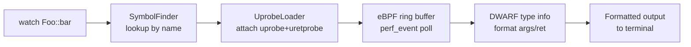

# watch

观测函数的入参、返回值和执行耗时。

## 语法

```
watch <function_name> [count] [timeout_ms]
```

## 参数

| 参数 | 类型 | 默认值 | 说明 |
|------|------|--------|------|
| `function_name` | 字符串 | 必填 | 目标函数名，支持全限定名（`namespace::Class::method`）和正则表达式（用引号包裹） |
| `count` | 整数 | 3 | 采集命中次数上限，达到后自动退出 |
| `timeout_ms` | 整数 | 3000 | 等待超时，单位毫秒，超时后退出 |

## 示例

```
# 观测一个成员函数，使用默认参数（最多3次，3秒超时）
uatu> watch fixtures::Calculator::add

# 观测5次，等待最长5秒
uatu> watch fixtures::Calculator::add 5 5000

# 用正则匹配所有 Foo 类的方法，只采集1次
uatu> watch "fixtures::Foo::.*" 1
```

## 输出格式

每次命中输出一条记录，字段含义如下：

| 字段 | 含义 |
|------|------|
| `ts` | 函数入口时间戳（Unix epoch 毫秒） |
| `func` | 命中的函数全限定名 |
| `cost` | 函数执行耗时（毫秒，精度微秒级） |
| `ret` | 函数返回值（整型/指针/布尔，浮点类型暂不支持） |
| `params` | 函数入参列表（按声明顺序，逗号分隔） |

### 示例输出

```
ts=1750000000123  func=fixtures::Calculator::add  cost=0.042ms  ret=3
  params=[1, 2]
```

## 行为边界

| 编译选项 | 支持情况 |
|----------|----------|
| `-g -O0` | 完整支持：参数、返回值、耗时均可采集 |
| `-g -O2` | 内联函数不可观测；编译器可能将短函数内联，此时 watch 将报告 "function inlined" |
| `strip` 二进制 | 无 DWARF 信息，返回 "no DWARF" 错误；只能按绝对地址操作 |

## 权限要求

- **eBPF 模式**（优先）：需要 `CAP_BPF` 能力，或以 root 运行。
- **ptrace 降级模式**：eBPF 不可用时自动降级；需要 `/proc/sys/kernel/yama/ptrace_scope` 为 `0`，或以 root 运行。

查看当前 ptrace_scope：

```bash
cat /proc/sys/kernel/yama/ptrace_scope
```

临时放开（重启后恢复）：

```bash
echo 0 | sudo tee /proc/sys/kernel/yama/ptrace_scope
```

## 常见错误

| 错误信息 | 原因 | 解决方法 |
|----------|------|----------|
| `no DWARF` | 目标二进制缺少调试信息 | 重新编译并加上 `-g` 选项 |
| `function inlined` | 函数被编译器内联，uprobe 无法注入 | 使用 `-O0` 编译，或在函数定义前加 `__attribute__((noinline))` |
| `permission denied` | 缺少 CAP_BPF 或 ptrace 权限 | 以 root 运行，或调整 `ptrace_scope`（见上） |
| `timeout` | 在超时时间内未命中指定次数 | 增大 `timeout_ms` 参数，或确认目标进程正在调用该函数 |

## 内部实现流程


